# Execution Plan

## Detailed Analysis Summary

### Transformation Scope (Brownfield)
- **Transformation Type**: Multi-concern architectural enhancement — auth, infrastructure, storage, and local dev all touched
- **Primary Changes**: Replace email/password auth with Google Sign-In; simplify 5 CloudFront distributions to 1; add S3 file storage; create single-command local stack
- **Related Components**: BE (app.js, DB schema, migrate.sh), FE (@app/auth package, mfe-auth app, shell app, webpack configs), IaC (Terraform), CI/CD (deploy.yml), Docker (docker-compose files)

### Change Impact Assessment
- **User-facing changes**: YES — login UI completely replaced (email form → Google button); authentication flow changes
- **Structural changes**: YES — auth architecture (API_KEY → session tokens); FE deployment model (5 CF distributions → 1)
- **Data model changes**: YES — new `users` and `sessions` tables required; `schema_auth.sql` must be applied via migrate.sh
- **API changes**: YES — new `POST /auth/google` endpoint; updated `authenticate()` middleware behavior
- **NFR impact**: YES — Security Baseline extension enabled; 15 SECURITY rules enforced as blocking constraints

### Component Relationships (Brownfield)

```
Primary: o_daria_be/src/app.js (auth middleware + new endpoint)
  └── Depends on: o_daria_be/src/db/schema_auth.sql (new tables)
  └── Depends on: google-auth-library (new npm dep)
  └── Feeds into: All protected routes (tenantId resolution)

Primary: o_daria_ui/packages/@app/auth (auth package)
  └── Consumed by: mfe-auth (LoginPage), shell (App.tsx, AuthProvider)
  └── Depends on: @react-oauth/google (new dep, lives in mfe-auth + shell)
  └── Shared singleton via Module Federation

Infrastructure: o_daria_ui/infra/terraform/ (Terraform IaC)
  └── Changes: 5 CF + 5 S3 → 1 CF + 2 S3 (FE + images)
  └── Feeds into: deploy.yml S3 sync targets

CI/CD: o_daria_ui/.github/workflows/deploy.yml
  └── Depends on: Terraform outputs (bucket name, CF distribution ID)

Local dev: docker-compose.local.yml (new, monorepo root)
  └── Depends on: o_daria_ui/Dockerfile.local (new)
  └── Depends on: o_daria_ui/infra/nginx/nginx.local.conf (new)
  └── Depends on: BE auth working + DB schema applied
```

### Risk Assessment
- **Risk Level**: HIGH
- **Rollback Complexity**: Difficult — auth changes affect both BE and FE simultaneously; DB schema is additive but existing API_KEY auth removed
- **Testing Complexity**: Complex — requires Google OAuth credentials, live Google token validation, Docker networking, Module Federation chunk loading
- **Risk Mitigations**:
  - API_KEY shortcut retained in `authenticate()` middleware (backward-compat for local curl testing)
  - New DB tables are additive (no existing table dropped or modified)
  - FE changes isolated to @app/auth package and mfe-auth app (other MFEs unaffected)
  - Terraform rewrite is net-simpler (fewer resources)

---

## Workflow Visualization

```mermaid
flowchart TD
    Start(["User Request"])

    subgraph INCEPTION["INCEPTION PHASE"]
        WD["Workspace Detection\nCOMPLETED"]
        RE["Reverse Engineering\nSKIPPED"]
        RA["Requirements Analysis\nCOMPLETED"]
        US["User Stories\nSKIPPED"]
        WP["Workflow Planning\nIN PROGRESS"]
        AD["Application Design\nEXECUTE"]
        UG["Units Generation\nEXECUTE"]
    end

    subgraph CONSTRUCTION["CONSTRUCTION PHASE - Per Unit"]
        FD["Functional Design\nEXECUTE"]
        NFRRQ["NFR Requirements\nEXECUTE"]
        NFRD["NFR Design\nEXECUTE"]
        ID["Infrastructure Design\nEXECUTE"]
        CG["Code Generation\nEXECUTE - ALWAYS"]
        BT["Build and Test\nEXECUTE - ALWAYS"]
    end

    subgraph OPERATIONS["OPERATIONS PHASE"]
        OPS["Operations\nPLACEHOLDER"]
    end

    Start --> WD
    WD --> RE
    RE --> RA
    RA --> US
    US --> WP
    WP --> AD
    AD --> UG
    UG --> FD
    FD --> NFRRQ
    NFRRQ --> NFRD
    NFRD --> ID
    ID --> CG
    CG --> BT
    BT --> OPS
    OPS --> End(["Complete"])

    style WD fill:#4CAF50,stroke:#1B5E20,stroke-width:3px,color:#fff
    style RA fill:#4CAF50,stroke:#1B5E20,stroke-width:3px,color:#fff
    style WP fill:#4CAF50,stroke:#1B5E20,stroke-width:3px,color:#fff
    style CG fill:#4CAF50,stroke:#1B5E20,stroke-width:3px,color:#fff
    style BT fill:#4CAF50,stroke:#1B5E20,stroke-width:3px,color:#fff
    style RE fill:#BDBDBD,stroke:#424242,stroke-width:2px,stroke-dasharray: 5 5,color:#000
    style US fill:#BDBDBD,stroke:#424242,stroke-width:2px,stroke-dasharray: 5 5,color:#000
    style AD fill:#FFA726,stroke:#E65100,stroke-width:3px,stroke-dasharray: 5 5,color:#000
    style UG fill:#FFA726,stroke:#E65100,stroke-width:3px,stroke-dasharray: 5 5,color:#000
    style FD fill:#FFA726,stroke:#E65100,stroke-width:3px,stroke-dasharray: 5 5,color:#000
    style NFRRQ fill:#FFA726,stroke:#E65100,stroke-width:3px,stroke-dasharray: 5 5,color:#000
    style NFRD fill:#FFA726,stroke:#E65100,stroke-width:3px,stroke-dasharray: 5 5,color:#000
    style ID fill:#FFA726,stroke:#E65100,stroke-width:3px,stroke-dasharray: 5 5,color:#000
    style Start fill:#CE93D8,stroke:#6A1B9A,stroke-width:3px,color:#000
    style End fill:#CE93D8,stroke:#6A1B9A,stroke-width:3px,color:#000
    linkStyle default stroke:#333,stroke-width:2px
```



### Text Alternative

```
INCEPTION PHASE:
  [x] Workspace Detection      — COMPLETED
  [-] Reverse Engineering      — SKIPPED (artifacts from prior exploration exist)
  [x] Requirements Analysis    — COMPLETED
  [-] User Stories             — SKIPPED (no multiple personas; backend/infra-heavy change)
  [~] Workflow Planning        — IN PROGRESS (this document)
  [ ] Application Design       — EXECUTE (new auth service component, S3 client)
  [ ] Units Generation         — EXECUTE (4 distinct units of work)

CONSTRUCTION PHASE (per unit):
  [ ] Functional Design        — EXECUTE (new DB schema, auth service contract, S3 interface)
  [ ] NFR Requirements         — EXECUTE (Security Baseline extension enabled; 15 rules)
  [ ] NFR Design               — EXECUTE (NFR patterns: token validation, CSP headers, IAM least-privilege)
  [ ] Infrastructure Design    — EXECUTE (Docker, Terraform, nginx, GitHub Actions)
  [ ] Code Generation          — EXECUTE ALWAYS
  [ ] Build and Test           — EXECUTE ALWAYS

OPERATIONS PHASE:
  [ ] Operations               — PLACEHOLDER
```

---

## Phases to Execute

### INCEPTION PHASE
- [x] Workspace Detection — COMPLETED
- [-] Reverse Engineering — SKIPPED (exploration artifacts already captured in prior session)
- [x] Requirements Analysis — COMPLETED
- [-] User Stories — SKIPPED
  - **Rationale**: No multiple user personas. The change is primarily technical (auth migration, infra simplification, local dev). The single user type (any Google account holder) doesn't benefit from persona-driven story decomposition.
- [~] Workflow Planning — IN PROGRESS
- [ ] Application Design — EXECUTE
  - **Rationale**: New components being introduced: `POST /auth/google` endpoint logic, Google token validation service, session management, S3 upload client. These require interface and method-level design decisions before code generation.
- [ ] Units Generation — EXECUTE
  - **Rationale**: 4 distinct units of work span different systems (BE auth, FE auth, local dev stack, AWS infra). Each has different dependencies, tech stacks, and risk profiles. Decomposition enables focused per-unit construction loops.

### CONSTRUCTION PHASE
- [ ] Functional Design — EXECUTE (per unit, where applicable)
  - **Rationale**: New DB tables (users, sessions), new service contracts (AuthService), new S3 interface — all require data model and interface definitions before coding.
- [ ] NFR Requirements — EXECUTE (per unit, where applicable)
  - **Rationale**: Security Baseline extension is ENABLED. Each unit must be assessed against the 15 SECURITY rules (e.g., token validation, HTTP headers, IAM least-privilege, no PII logging, input validation).
- [ ] NFR Design — EXECUTE (per unit, where applicable)
  - **Rationale**: NFR patterns need explicit design decisions: CSP header values, S3 bucket policies, session token entropy, structured logging format.
- [ ] Infrastructure Design — EXECUTE (per unit, where applicable)
  - **Rationale**: Significant infrastructure changes: Terraform rewrite (5 CF → 1), nginx configuration, Docker multi-stage build, GitHub Actions S3 sync update.
- [ ] Code Generation — EXECUTE (ALWAYS, per unit)
- [ ] Build and Test — EXECUTE (ALWAYS, after all units)

### OPERATIONS PHASE
- [ ] Operations — PLACEHOLDER

---

## Units of Work

The 4 units below will be constructed in sequence (each dependency-ordered):

### Unit 1: Backend Auth (o_daria_be)
- `schema_auth.sql` — users + sessions tables
- `migrate.sh` — apply schema_auth.sql as 3rd file
- `app.js` — POST /auth/google + updated authenticate() middleware
- `package.json` — add google-auth-library
- `docker-compose.yml` — mount schema_auth.sql in db init
- `.env.example` — add GOOGLE_CLIENT_ID, FRONTEND_URL

### Unit 2: Frontend Auth (@app/auth + mfe-auth + shell)
- `packages/@app/auth/src/types.ts` — GoogleAuthResponse, updated User
- `packages/@app/auth/src/tokenStorage.ts` — token storage
- `packages/@app/auth/src/AuthService.ts` — loginWithGoogle + logout
- `packages/@app/auth/src/AuthContext.tsx` — loginWithGoogle
- `packages/@app/auth/src/AuthProvider.tsx` — token injection, mount restore
- `packages/@app/auth/src/index.ts` — updated exports
- `apps/mfe-auth/package.json` — add @react-oauth/google
- `apps/mfe-auth/src/pages/LoginPage.tsx` — Google button
- `apps/mfe-auth/webpack.config.js` — GOOGLE_CLIENT_ID DefinePlugin
- `apps/shell/src/App.tsx` — GoogleOAuthProvider wrapper
- `apps/shell/webpack.config.js` — GOOGLE_CLIENT_ID DefinePlugin

### Unit 3: Local Dev Stack
- `docker-compose.local.yml` (monorepo root)
- `o_daria_ui/Dockerfile.local` — multi-stage pnpm build → nginx
- `o_daria_ui/infra/nginx/nginx.local.conf`

### Unit 4: AWS Infrastructure
- `o_daria_ui/infra/terraform/` — rewrite for 1 CF + 2 S3
- `o_daria_ui/.github/workflows/deploy.yml` — prefix-path S3 sync
- `o_daria_ui/.env.example` — GOOGLE_CLIENT_ID

---

## Package Change Sequence (Brownfield)

**Sequential — dependencies must be respected:**

1. **Unit 1: Backend Auth** — Must come first. FE auth depends on `POST /auth/google` existing. DB schema must be applied before any auth flow can be tested.
2. **Unit 2: Frontend Auth** — Depends on Unit 1 BE endpoint being defined (contract must be stable). `@app/auth` changes cascade to mfe-auth and shell.
3. **Unit 3: Local Dev Stack** — Depends on Units 1+2 being complete (docker-compose.local.yml builds both BE and FE). End-to-end local testing validates both prior units.
4. **Unit 4: AWS Infrastructure** — Depends on FE being buildable (Unit 2). Terraform changes are independent of auth logic but consume the same built FE artifacts.

---

## Module Update Strategy

- **Update Approach**: Sequential (dependency-ordered)
- **Critical Path**: Unit 1 (BE auth schema + endpoint) → Unit 2 (FE auth) → Unit 3 (local stack validates both) → Unit 4 (AWS infra)
- **Coordination Points**: 
  - `POST /auth/google` API contract (BE Unit 1 ↔ FE Unit 2)
  - `GOOGLE_CLIENT_ID` env var (shared across BE + FE units)
  - `tenant_id` type compatibility (UUID in users table ↔ TEXT in existing tables — bridged via `.toString()` in middleware)
- **Testing Checkpoints**:
  - After Unit 1: `curl` test against `POST /auth/google` with a real Google token
  - After Unit 2: `pnpm dev` isolated FE test (mfe-auth standalone) confirms Google button renders
  - After Unit 3: `docker compose -f docker-compose.local.yml up --build` end-to-end smoke test
  - After Unit 4: CloudFront URL loads shell + MFEs correctly

---

## Success Criteria

- **Primary Goal**: First customer review readiness — Google login works, deployment is cost-efficient, local testing is one command
- **Key Deliverables**:
  - Working Google Sign-In flow (FE → BE → DB → session token → protected routes)
  - Single CloudFront distribution serving all MFEs with correct path routing
  - `docker compose -f docker-compose.local.yml up --build` → `http://localhost:8080` → Google login
  - S3 bucket for profile image persistence
- **Quality Gates**:
  - All 15 SECURITY rules compliance verified per unit
  - All existing passing tests remain passing (NFR-07)
  - API_KEY dev shortcut still works (backward-compat, FR-01)
  - No hardcoded secrets in source (NFR-01, SECURITY-12)
