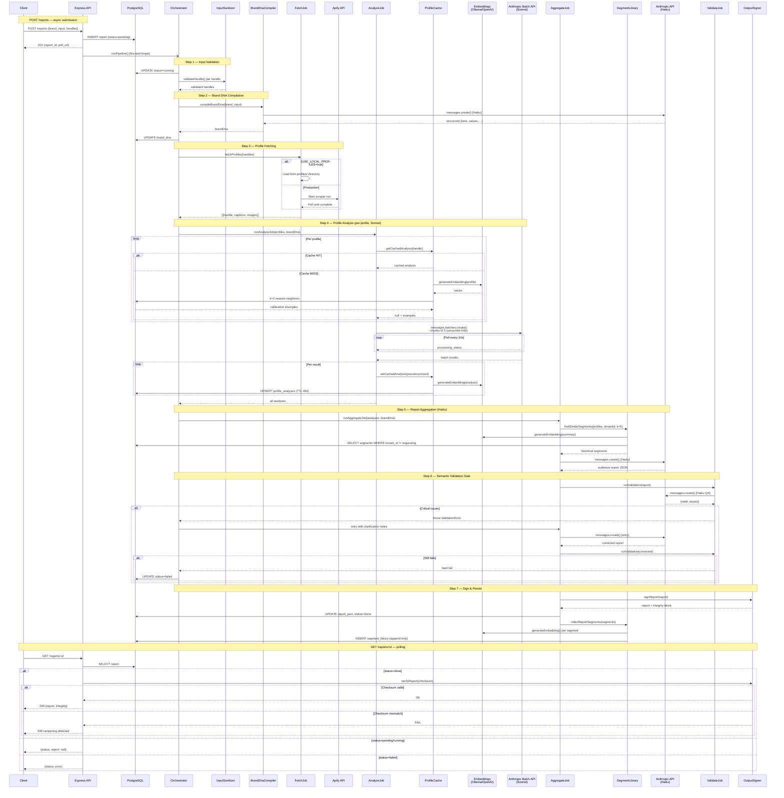

# Pipeline Sequence Diagram

```mermaid
sequenceDiagram
    participant C as Client
    participant API as Express API
    participant DB as PostgreSQL
    participant O as Orchestrator
    participant San as InputSanitizer
    participant DNA as BrandDnaCompiler
    participant F as FetchJob
    participant Apify as Apify API
    participant A as AnalyzeJob
    participant PC as ProfileCache
    participant Emb as Embeddings<br/>(Ollama/OpenAI)
    participant Batch as Anthropic Batch API<br/>(Sonnet)
    participant Agg as AggregateJob
    participant SL as SegmentLibrary
    participant H as Anthropic API<br/>(Haiku)
    participant V as ValidateJob
    participant Sign as OutputSigner

    Note over C,API: POST /reports — async submission
    C->>API: POST /reports {brand_input, handles}
    API->>DB: INSERT report (status=pending)
    API-->>C: 202 {report_id, poll_url}
    API-)O: runPipeline() [fire-and-forget]

    Note over O,San: Step 1 — Input Validation
    O->>DB: UPDATE status=running
    O->>San: validateHandle() per handle
    San-->>O: validated handles

    Note over O,DNA: Step 2 — Brand DNA Compilation
    O->>DNA: compileBrandDna(brand_input)
    DNA->>H: messages.create() [Haiku]
    H-->>DNA: structured {tone, values, ...}
    DNA-->>O: brandDna
    O->>DB: UPDATE brand_dna

    Note over O,Apify: Step 3 — Profile Fetching
    O->>F: fetchProfiles(handles)
    alt USE_LOCAL_PROFILES=true
        F->>F: Load from profiles/ directory
    else Production
        F->>Apify: Start scraper run
        Apify-->>F: Poll until complete
    end
    F-->>O: [{handle, captions, images}]

    Note over O,Batch: Step 4 — Profile Analysis (per-profile, Sonnet)
    O->>A: runAnalyzeJob(profiles, brandDna)

    loop Per profile
        A->>PC: getCachedAnalysis(handle)
        alt Cache HIT
            PC-->>A: cached analysis
        else Cache MISS
            PC->>Emb: generateEmbedding(profile)
            Emb-->>PC: vector
            PC->>DB: k=2 nearest neighbors
            DB-->>PC: calibration examples
            PC-->>A: null + examples
        end
    end

    A->>Batch: messages.batches.create()<br/>chunks of 5 (uncached only)
    loop Poll every 10s
        Batch-->>A: processing_status
    end
    Batch-->>A: batch results

    loop Per result
        A->>PC: setCachedAnalysis(pseudonymized)
        PC->>Emb: generateEmbedding(analysis)
        PC->>DB: UPSERT profile_analyses (TTL 45d)
    end

    A-->>O: all analyses

    Note over O,H: Step 5 — Report Aggregation (Haiku)
    O->>Agg: runAggregateJob(analyses, brandDna)
    Agg->>SL: findSimilarSegments(profiles, tenantId, k=5)
    SL->>Emb: generateEmbedding(summary)
    SL->>DB: SELECT segments WHERE tenant_id != requesting
    SL-->>Agg: historical segments
    Agg->>H: messages.create() [Haiku]
    H-->>Agg: audience report JSON

    Note over O,V: Step 6 — Semantic Validation Gate
    Agg->>V: runValidation(report)
    V->>H: messages.create() [Haiku QA]
    H-->>V: {valid, issues}

    alt Critical issues
        V-->>O: throw ValidationError
        O->>Agg: retry with clarification notes
        Agg->>H: messages.create() [retry]
        H-->>Agg: corrected report
        Agg->>V: runValidation(corrected)
        alt Still fails
            V-->>O: hard fail
            O->>DB: UPDATE status=failed
        end
    end

    Note over O,Sign: Step 7 — Sign & Persist
    Agg->>Sign: signReport(report)
    Sign-->>Agg: report + integrity block
    Agg->>DB: UPDATE report_json, status=done

    Agg->>SL: indexReportSegments(segments)
    SL->>Emb: generateEmbedding() per segment
    SL->>DB: INSERT segment_library (append-only)

    Note over C,Sign: GET /reports/:id — polling
    C->>API: GET /reports/:id
    API->>DB: SELECT report
    alt status=done
        API->>Sign: verifyReport(checksum)
        alt Checksum valid
            Sign-->>API: OK
            API-->>C: 200 {report, integrity}
        else Checksum mismatch
            Sign-->>API: FAIL
            API-->>C: 500 tampering detected
        end
    else status=pending/running
        API-->>C: {status, report: null}
    else status=failed
        API-->>C: {status, error}
    end
```
