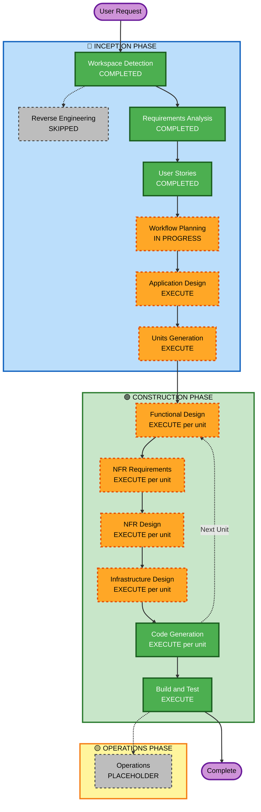

# Execution Plan
# Marketing Audience Analysis Platform (o_daria_ui)

**Version**: 1.0  
**Date**: 2026-04-07  
**Status**: Awaiting Approval

---

## Detailed Analysis Summary

### Change Impact Assessment

| Impact Area | Assessment |
|---|---|
| **User-facing changes** | Yes — entire new SPA; all screens and flows are new |
| **Structural changes** | Yes — micro-frontend architecture with module federation |
| **Data model changes** | Yes — new project, user, report, and Canva link data models |
| **API changes** | Yes — integrating two external APIs (analysis + Canva 2-step flow) |
| **NFR impact** | Yes — Security Baseline enforced (blocking), AWS cloud deployment, structured logging required |

### Risk Assessment

| Attribute | Level |
|---|---|
| **Risk Level** | Medium |
| **Rollback Complexity** | Easy (greenfield — nothing to break, no data migration) |
| **Testing Complexity** | Moderate — external API mocking needed; micro-frontend integration testing |
| **Security Risk** | Medium — enforced security baseline with authentication, session management, and CORS |

**Key risks:**
- External API contract not fully defined (report schema and Canva 2-step flow details TBD)
- Micro-frontend module federation setup complexity
- CORS configuration between micro-frontend modules and external APIs

---

## Workflow Visualization



**Text Alternative**:
```
INCEPTION PHASE:
  [x] Workspace Detection       — COMPLETED
  [-] Reverse Engineering       — SKIPPED (Greenfield)
  [x] Requirements Analysis     — COMPLETED
  [x] User Stories              — COMPLETED
  [~] Workflow Planning         — IN PROGRESS
  [ ] Application Design        — EXECUTE
  [ ] Units Generation          — EXECUTE

CONSTRUCTION PHASE (per unit):
  [ ] Functional Design         — EXECUTE
  [ ] NFR Requirements          — EXECUTE
  [ ] NFR Design                — EXECUTE
  [ ] Infrastructure Design     — EXECUTE
  [ ] Code Generation           — EXECUTE (ALWAYS)
  [ ] Build and Test            — EXECUTE (ALWAYS)

OPERATIONS PHASE:
  [-] Operations                — PLACEHOLDER
```

---

## Phases to Execute

### 🔵 INCEPTION PHASE

- [x] Workspace Detection — **COMPLETED**
- [-] Reverse Engineering — **SKIPPED** (Greenfield project — no existing codebase)
- [x] Requirements Analysis — **COMPLETED**
- [x] User Stories — **COMPLETED** (11 stories, 3 personas, 4 epics)
- [~] Workflow Planning — **IN PROGRESS** (this document)
- [ ] Application Design — **EXECUTE**
  - **Rationale**: New greenfield SPA with micro-frontend architecture. Component boundaries, module contracts, and service layer patterns must be defined before code generation to ensure clean micro-frontend isolation.
- [ ] Units Generation — **EXECUTE**
  - **Rationale**: Four distinct micro-frontend modules (Auth, Projects, Reports, Canva) plus a Shell host app. Each is an independently deployable unit requiring separate design and code generation passes.

### 🟢 CONSTRUCTION PHASE (per unit)

- [ ] Functional Design — **EXECUTE** (per unit)
  - **Rationale**: New data models (Project, User, Report, CanvaLink), project status state machine, and API integration contracts need detailed functional design for each unit.
- [ ] NFR Requirements — **EXECUTE** (per unit)
  - **Rationale**: Security Baseline extension is ENABLED with blocking constraints; AWS deployment target; performance and logging requirements all need NFR assessment per unit.
- [ ] NFR Design — **EXECUTE** (per unit)
  - **Rationale**: Follows NFR Requirements; security patterns (auth guards, CORS, CSP, rate limiting, structured logging) must be designed into each module.
- [ ] Infrastructure Design — **EXECUTE** (per unit)
  - **Rationale**: AWS deployment (S3 + CloudFront), IaC required; CDN, security headers, and environment configuration need to be mapped per unit.
- [ ] Code Generation — **EXECUTE** (ALWAYS, per unit)
- [ ] Build and Test — **EXECUTE** (ALWAYS)

### 🟡 OPERATIONS PHASE

- [-] Operations — **PLACEHOLDER** (future expansion)

---

## Proposed Units of Work

| Unit | Description | Key Concerns |
|---|---|---|
| **Unit 1: Shell / Host App** | Micro-frontend host — routing, module federation config, global auth state, global error boundary | Module federation setup, shared auth context, lazy loading |
| **Unit 2: Auth Module** | Registration, login, logout, password reset; session management | SECURITY-12, brute force protection, token validation |
| **Unit 3: Projects Module** | Project CRUD, project list, project detail, status display | State machine (DRAFT→PROCESSING→REPORT_READY→PRESENTATION_READY), IDOR prevention |
| **Unit 4: Reports Module** | Automated report fetch trigger, status polling, summary card display, error state | External API integration, polling strategy, error handling |
| **Unit 5: Canva Module** | Generate Presentation flow, 2-step API calls, Canva link display, error handling | Sequential API orchestration, progress state, error recovery |

---

## Success Criteria

- **Primary Goal**: Working SPA for marketing agencies to manage projects, view audience analysis reports, and generate Canva presentations
- **Key Deliverables**: 5 micro-frontend units, AWS deployment IaC, full test suite, build instructions
- **Quality Gates**:
  - All SECURITY rules verified at each stage (blocking)
  - All 11 user stories have passing acceptance criteria coverage
  - External API integration contracts documented
  - No hardcoded secrets in source code
  - Lock file committed; vulnerability scan configured in CI
